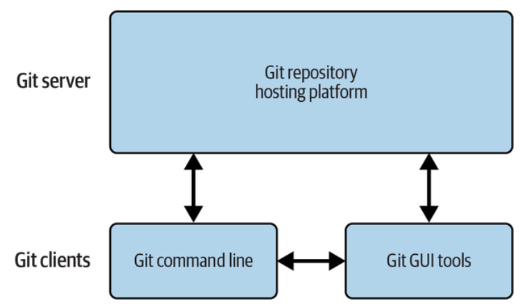
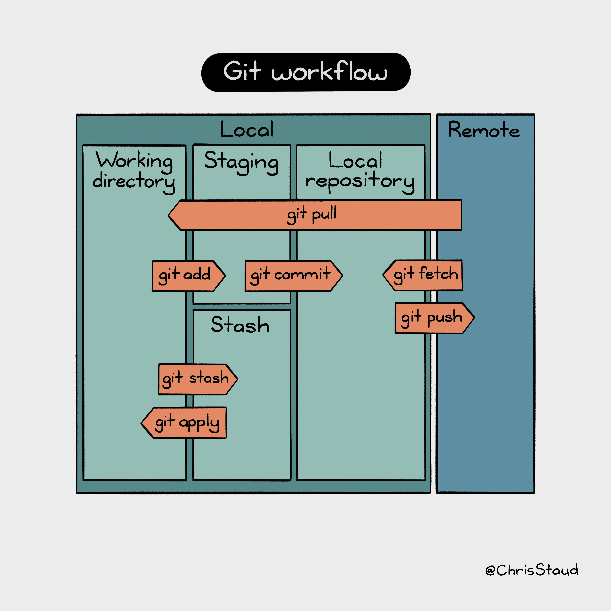
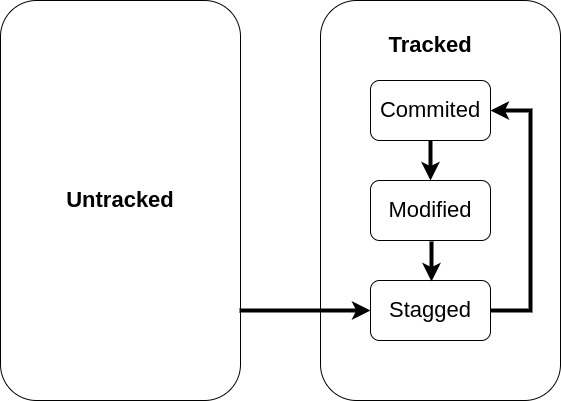

¿Qué es Git?
---

Git es un sistema de control de versiones distribuido, open source y libre creado por Linus Torvalds (creador de Linux).


<!-- pause -->
* **¿Control de versiones?**

<!-- pause -->


<!-- pause -->
* **¿Sistema distribuido?**

<!-- pause -->
Un **sistema distribuido** está compuesto de múltiples componentes que operan concurrentemente y se comunican entre sí mediante el envío y recepción de mensajes en una red. 

<!-- pause -->
El comportamiento completo de un sistema distribuido es resultado de comportamiento de sus componentes individuales y cómo estos interactúan entre sí.

<!-- end_slide -->


Componentes del ecosistema de Git
---

Tomado de _Version Control with Git, 3rd Edition, O'Reilly_

<!-- end_slide -->

Caracteristicas de Git
---

* **Git almacena los cambios como snapshots**
<!-- pause -->
> Git toma una captura de los cambios hechos al estado del respositorio en un punto específico de tiempo. En la terminología de Git esto es conocido como un **commit**. El snapshot es una fotografía del estado del repositorio en un punto en el tiempo.
<!-- pause -->
* **Git está pensado para el desarrollo local**
<!-- pause -->
> En Git se trabaja en una copia local del repositorio remoto. Esta copia es conocida como un **repositorio local**, o un **clon** del repositorio remoto alojado en un servidor de Git.
<!-- pause -->
* **Los comandos de Git son explícitos**
<!-- pause -->
>Git espera que el cliente proporcione instrucciones sobre qué hacer y cuándo hacerlo.
<!-- pause -->
* **Git está diseñado para reforzar el desarrollo no lineal o asíncrono**
<!-- pause -->
> Git permite idear y experimentar con varias implementaciones de funciones para encontrar soluciones viables para el proyecto, permitiéndonos diversificar y trabajar en paralelo.
> Esta metodolgía de trabajo es conocida como **branching** y es una práctica común que asegura la integridad del desarrollo de la línea principal del proyecto. 
<!-- end_slide -->

Git command line
---

La interfaz de linea de comando de Git está diseñada para poner el control total del repositorio nuestras manos.

De entrada, podemos verificar si contamos con una instalación de Git en nuestro equipo al ejecutar la instrucción:

```bash +exec
git --version
```

Si ejecutamos la instrucción ```git```, sin argumentos, Git listará una lista de opciones así como los subcomandos más usados.

Para obtener una lista completa de subcomandos de Git, podemos ejecutar ```git help --all```.

Los comandos de ```git``` entienden opciones "cortas" y "largas". Por ejemplo, el comando ```git commit``` entiende por igual las siguientes instrucciones:

```bash 
git commit -m "Fix a typo."
git commit --message="Fix a typo."
```

<!-- end_slide -->

Introducción rápida a Git
---

En esta sección crearemos un nuevo repositorio, agregaremos archivos y realizaremos algunos seguimientos y revisiones. 

Podemos crear un repositorio de dos formas:

* Creando un repositorio desde cero y posteriormente poblando de archivos y contenido.
* Clonando un repositorio existente de algún servidor remoto de Git.
<!-- end_slide -->


# Preparándonos para trabajar con Git
Necesitamos realizar una configuración previa para trabajar con Git. Como mínimo, Git necesita el nombre y dirección de correo electrónico del cliente antes de realizar algún commit en el repositorio.

Podemos nuestra identidad en el archivo de configuración mediante el commando ```git config```:

```bash 
git config user.name "Milo"
git config user.email "hermilocg@tec.mx"
```

Si decides no incluir tu identidad, deberás especificar tu identidad para cada ```git commit``` al agregar el argumento ```--author``` al final del comando:
```bash
git commit -m "log message" --author="Milo <hermilocg@tec.mx>"
```
<!-- end_slide -->

# Trabajando con un repositorio local

Comenzaremos creando un nuevo repositorio local vacío en nuestro equipo.

## Creación del repositorio 
Crearemos un repositorio para nuestro proyecto personal. Crearemos este repositorio de cero y agregaremos archivos para nuesto proyecto en nuestro directorio local. 

Ejecutaremos las siguientes instrucciones para crear el directorio de nuestro proyecto personal, así como también agregaremos un archivo llamado ```main.R```

```bash
mkdir mi_proyecto
cd mi_proyecto
echo "a <- c(1,2,3,4,5)" > main.R
```

Para convertir nuestro directorio ```mi_proyecto``` en un repositorio de Git, ejecutamos el comando ```git init```. Podemos ser más explícitos y especificar el nombre de la rama de inicio de repositorio con la opción ```-b``` seguido por la rama default llamada ```main```:

```bash
git init -b main
```

<!-- end_slide -->

## Creación del repositorio 

El comando ```git init``` crea un directorio oculto llamado *.git* al nivel raíz de nuestro proyecto. Toda la información de revisiones, seguimiento y metadatos son almacenados en este directorio oculto.

Git considera el directorio ```mi_proyecto``` como el *working directory*. Este directorio contiene la versión actual de los archivos de nuestro proyecto. Cuando realizamos cambios a archivos existentes o agregamos nuevos archivos a nuestro proyecto, Git registra esos cambios en el folder oculto *.git*

## Agregar un archivo al repositorio
Hasta este momento, sólo hemos *creado* un **repositorio vacío**. Aunque el archivo  ```main.R``` existe en el directorio ```mi_proyecto```, para Git, este es el *working directory*, una representación de un directorio donde modificamos con frecuencia nuestros archivos.

Cuando hemos finalizado los cambios a los archivos del *working directory* y queremos depositar dichos cambios en el repositorio de Git, debemos hacerlo explícitamente utilizando el comando  ```git add <file>```

```bash
git add main.R
```

> Podemos agregar al repositorio todos los archivos del working directory con la instrucción ```git add .```, sin embargo, se recomienda ser intencional y preciso con los archivos que se planea agregar al repositorio, principalmente para evitar que se incluya información confidencial o archivos no deseados cuando se realizan commits.

<!-- end_slide -->
## Agregar un archivo al repositorio

Con el comando ```git add```, Git entiende que tienes la intención de incluir la actualización final de la modificación en el archivo ```main.R``` como una revisión en el repositorio.

**Sin embargo, hasta ahora Git simplemente ha preparado (staged) el archivo, un paso intermedio antes de tomar el snapshot del repositorio con el commit**.

Git separa los pasos ```add``` y ```commit``` para evitar volatilidad al mismo tiempo que proporciona flexibilidad y granularidad en la forma de registrar los cambios.

¿Imagina lo perturbador, confuso y lento que sería actualizar el repositorio cada vez que agrega, elimina o cambia un archivo?

En su lugar, se pueden agrupar varios pasos provisionales y relacionados, como la agregación de un archivo, manteniendo así el repositorio en un estado estable y coherente.

Se recomienda realizar un esfuerzo por agrupar por lotes de cambios lógicos y con sentido antes de realizar un commit. Esta operación es llamada *atomic commit*.

Al ejecutar la instrucción ```git status``` se revela este estado intermedio entre el working directory y el repositorio.

```bash
git status
```
<!-- end_slide -->
## Agregar un archivo al repositorio

Después de preparar el archivo, el siguiente paso lógico es enviar el archivo al repositorio con un commit. Una vez que hacemos commit al archivo que deseamos agregar al repositorio, este se convierte en parte del *repository commit history*. Por brevedar, nos referimos a este como el *repo history*.

Cada vez que hacemos un commit, Git registra otros metadatos como el mensaje del commit así como el autor del cambio, fecha y hora del commit, etc.

Se recomienda que el comando de commit de git sea informativo y que proporcione un mensaje de registro conciso y significativo utilizando lenguaje activo para indicar el cambio que introduce. Esto es muy útil cuando se necesita recorrer el historial del repositorio para rastrear un cambio específico o identificar rápidamente los cambios de un commit sin tener que profundizar en los detalles del cambio.

Hagamos commit al archivo ```main.R```:

```bash
git commit -m "Iniciamos el repositorio con el archivo main.R"
```

Podemos verificar el estatus del repositorio con la instrucción
```bash
git status
```

<!-- end_slide -->
### Hagamos otro commit

Para hacer un nuevo commit, haremos una modificación al archivo ```main.R```.

Agregaremos las siguiente lineas de código a nuestro archivo:
```r {2-3} +line_numbers
a <- c(1,2,3,4,5)
b<-a*10
print(b)
```

Preparamos el archivo actualizado ```main.R``` con la instrucción

```bash
git add main.R
```

Actualizamos el archivo en el repositorio mediante el commit:
```bash
git commit -m "Actualizamos el archivo main.R"
```
<!-- end_slide -->

¿Qué hemos hecho hasta ahora?
---
# Git Workflow


<!-- end_slide -->

¿Qué hemos hecho hasta ahora?
---
# States of a file in a Git repo and the transition between them


<!-- end_slide -->

## Ver historial de commits

El commando ```git log``` devuelve el historial de commits en el repositorio:

```bash
git log
```

El comando imprime información detallada para cada commit en el repositorio. Podemos reducir la información agregando la opción ```--oneline```:

```bash
git log --oneline
```

Si necesitamos ver más detalles de un commit en particular, usamos el comando ```git show``` mas el ID number del commit:

```bash
git show <ID number>
```

<!-- end_slide -->

## Ver diferencias entre commits

Para inspeccionar las diferencias entre dos commits, utilizamos el comando ```git diff``` más los ID number de los commits que deseamos ver las diferencias

```bash
git diff <ID number commit earlier> <ID number commit latest>
```

Un signo más (+) precede a cada línea de contenido nuevo después del signo menos (–), lo que indica contenido eliminado.

<!-- end_slide -->

Trabajo con un repositorio compartido
---


Hasta ahora hemos inicializado un nuevo repositorio y hemos realizado cambios a este. Todos los cambios solo están disponibles en nuestra computadora de  desarrollo local. Este es un buen ejemplo de cómo se puede gestionar un proyecto que sólo está disponible para un cliente (nosotros). Pero, **¿cómo se puede trabajar de forma colaborativa en un repositorio alojado en un servidor Git?**

## Copia local de un repositorio remoto
Podemos crear una copia completa, o un **clone**, de un repositorio (remoto o local) con el comando ```git clone```. Así es como podemos colaborar con otras desarrolladoras, realizando cambios en los mismos archivos y manteniéndonos sincronizados con los cambios de otras versiones del mismo repositorio.

Para clonar un repositorio remoto en nuestro equipo, ejecutamos la instrucción:

```bash
git clone <URL de repositorio remoto>
```

Por default, la instrucción ```git clone``` realiza una copia de la rama ```main``` de repositorio. Podemos usar la opción ```-b``` para clonar una rama del repositorio:

```bash
git clone -b <RAMA> <URL de repositorio remoto>
```

<!-- end_slide -->
Trabajo con un repositorio compartido
---

## Actualización hacia un repositorio remoto

Al igual que con nuestro repositorio local creado desde 0, este repositorio clonado de un repositorio remoto podemos hacer modificaciones y actualizaciones sin ningún problema **a nuestra copia local**. Para hacer actualizaciones al repositorio remoto, necesitamos permisos del dueño del repositorio.

Dando por hecho que tenemos los permisos suficientes, podemos realizar actualizaciones al repositorio remoto mediante la instrucción ```git push origin``` haciendo referencia a la rama particular donde se realizará la actualización:

```bash
git push origin <branch_name>
```

## Actualización desde un repositorio remoto

Imaginemos que el repositorio remoto que clonamos en nuestro equipo ha sido actualizado. ¿Qué debemos hacer para sincronizar nuestro repositorio local con los cambios remotos? Utilizamos el comando ```git pull``` para descarga los nuevos commit del repositorio y fusionar la rama remota con la rama local actual.

```bash
git pull
```
<!-- end_slide -->

## Fetching changes from a remote without modifying local branches: ```git fetch```

```git pull``` performs two actions: fetching the changes from a remote repository and merging them into the current branch. Sometimes you may wish to download the new commits from the remote repository without merging them into your current branch (or without merging them yet). To do this, you can use the ```git fetch``` command. git fetch performs the fetching action of downloading the new commits but skips the merge step (which you can manually perform later)

<!-- end_slide -->

## Creating a new local branch from the current branch

Create a new branch
```bash
git branch <branch_name>
```
Listing branches
```bash
git branch
```
Setting branch to be current branch
```bash
git checkout <branch_name>
```
> (Make sure you’ve committed any changes on the current branch before checking out a new branch. If you don’t do this, git checkout will refuse to check out the new branch if there are changes in that branch to a file with uncommitted changes. If you wish to overwrite these uncommitted changes anyway, you can force this with git checkout --force. Another solution is git stash, which allows temporary storage of changes)

<!-- end_slide -->


## Pushing a local branch remotely
```bash
git remote add origin <URL remote repository>
git push origin <new_local_branch_name>
```

## Merging an existing branch into the current branch

At some point, you have a branch you’re done with, and you want to bring all the commits made on it into another branch. This process is known as a merge

```bash
git merge <different_branch>
```